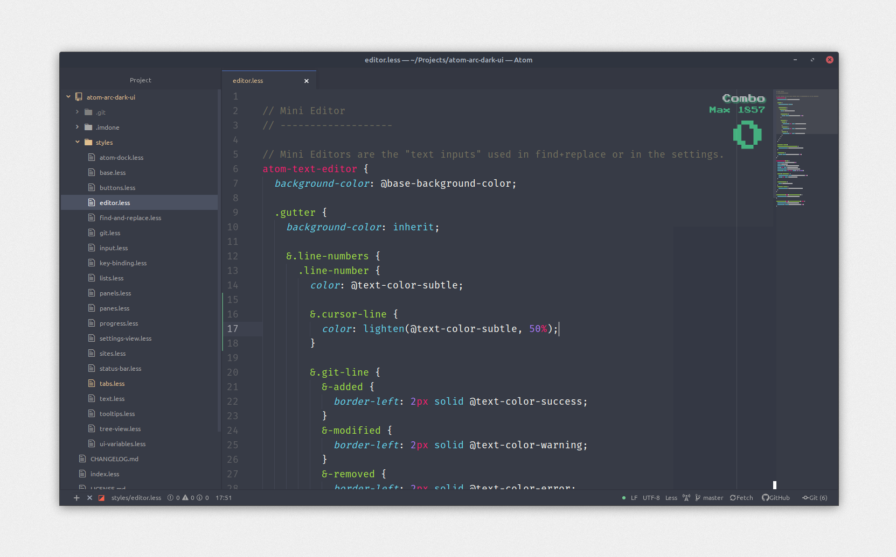

# Atom Arc Dark UI

__Arc Dark__ is an Atom theme heavily inspired by the __[Arc Theme for Gnome](https://github.com/horst3180/arc-theme)__.

## 🚀 Getting started

> The font used in the screenshot is [Fira Mono](https://github.com/mozilla/Fira).

> The "Combo" Score System seen on the top right corner is the ['activate-power-mode'](https://atom.io/packages/activate-power-mode) plugin (not included in this theme).

> The syntax highlight is [Monokai](https://atom.io/packages/monokai). (Not included in this theme.)

---

#### Installation
Install the theme via Atom by going to [Preferences/Settings > Install]() and search for *Atom Arc Dark UI* (or atom-arc-dark-ui, make sure you're searching under 'Themes'), or install through CLI:

`
$ apm install atom-arc-dark-ui
`
